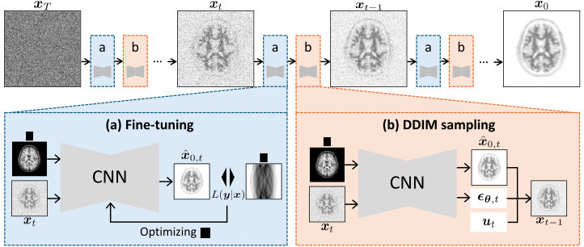

# PET Image Reconstruction Using Deep Diffusion Image Prior (DDIP)

[Fumio Hashimoto](https://sites.google.com/view/fumio-hashimoto/) and [Kuang Gong](https://gong-lab.com/)

This repository provides code for diffusion-based PET image
reconstruction using the Deep Diffusion Image Prior (DDIP) framework.

Paper: F. Hashimoto and K. Gong, PET Image Reconstruction Using Deep
Diffusion Image Prior, IEEE Transactions on Medical Imaging, 2026.
https://ieeexplore.ieee.org/document/11369249

## Overview



## Requirements

Create the environment using:

```
conda env create -f environment.yml
conda activate ddip
```

## Quick Start

1.  Download the pre-trained model from [this link](https://www.dropbox.com/scl/fi/4xyqttufeffg9mxc1fwfi/model1100000.pt?rlkey=v4gq7zsemgutln3anhl5ycwji&st=dysb2xr6&dl=0) and place it in the `./checkpoints/` directory.

2.  Download the test data from [this link](https://www.dropbox.com/scl/fo/chwflsweh8pr4mjb6ck0c/AMW4qZnpRCOHzPIXg11EOOo?rlkey=eobjxfen9fj9ec596cqru8htw&st=e6pmc4c4&dl=0) and place it in the `./data/` directory.

3.  Run:

```
bash run_ddiprecon_2d.sh
```

4.  Output:

```
results/result.npy
```

## Notes

-   PET forward and back projection are implemented using parallelproj (https://parallelproj.readthedocs.io/).
-   Current implementation supports 2D experiments.

## Citation

If you use this code in academic work, please cite:

```
@article{Hashimoto2026DDIP,
  author   = {Hashimoto, Fumio and Gong, Kuang},
  journal  = {IEEE Transactions on Medical Imaging},
  title    = {PET Image Reconstruction Using Deep Diffusion Image Prior},
  year     = {2026},
  doi      = {10.1109/TMI.2026.3659792}
}
```

## Acknowledgements

- Base code reference: https://github.com/hyungjin-chung/DDIP3D
- PET projector implementation based on: https://parallelproj.readthedocs.io/
- Simulation data: https://brainweb.bic.mni.mcgill.ca/

## Contact

For any questions, please contact fumio.hashimo@ufl.edu.
